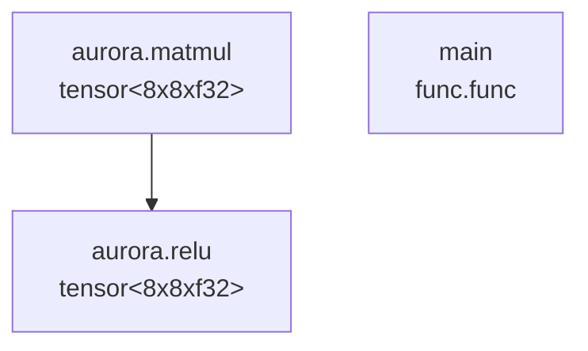

# AuroraAICompiler


AuroraAICompiler is a modular AI compiler stack designed for high-performance execution of neural network models. Built with MLIR, LLVM, and native runtime components, it transforms ONNX and PyTorch models into optimized machine code for efficient inference.

---

## Why this project?

This compiler was inspired by Ampere Computing’s vision for AI-native silicon and their AmpereOne Aurora platform. The goal is to replicate the work of an AI Compiler Engineer at Ampere—designing and delivering high-performance compilers for machine learning workloads using MLIR, LLVM IR, and real runtime integration.

---

## Overview

AuroraAICompiler converts deep learning models from frameworks like PyTorch and ONNX into optimized executables:

1. **Model Import** – Parses ONNX or PyTorch model definitions
2. **Representation** – Converts models to a custom [MLIR](https://mlir.llvm.org/) dialect for AI operations
3. **Optimization** – Applies control/data flow compiler techniques (e.g., DCE, fusion, unrolling)
4. **Code Generation** – Lowers to [LLVM IR](https://llvm.org/docs/LangRef.html) and generates optimized native code
5. **Execution** – Supports JIT and AOT execution with a lightweight runtime
6. **Benchmarking** – Measures performance vs reference implementations

---

## Architecture

```
┌───────────────┐     ┌──────────────┐     ┌────────────────┐     ┌────────────┐
│ ONNX/PyTorch  │────▶│ Aurora IR    │────▶│ LLVM IR        │────▶│ Optimized  │
│ Model Import  │     │ + Optimizers │     │ Generation     │     │ Executable │
└───────────────┘     └──────────────┘     └────────────────┘     └────────────┘
```

---

## Key Components

* **Model Importer** – Python tools to ingest [ONNX](https://onnx.ai/) and [PyTorch](https://pytorch.org/) models
* **Aurora Dialect** – Custom MLIR dialect for representing AI workloads (Conv2D, MatMul, etc.)
* **Optimization Pipeline** – Applies domain-specific and general compiler passes
* **LLVM Code Generator** – Lowers Aurora IR to LLVM IR and compiles to native code
* **Runtime Execution** – Lightweight C++ engine for JIT/AOT compiled models
* **Benchmarking Tools** – Scripts to measure performance vs baseline PyTorch or ONNXRuntime

---

## Prerequisites

* CMake 3.20+
* LLVM/MLIR 16.0+
* Python 3.8+
* C++17 compatible compiler
* ONNX 1.12+
* PyTorch 2.0+ (optional)

---

## Building the Compiler

```bash
# Clone the repository
git clone https://github.com/yourusername/AuroraAICompiler.git
cd AuroraAICompiler

# Configure and build
mkdir build && cd build
cmake ..
make -j$(nproc)

# Install (optional)
make install
```

---

## Running Examples

```bash
# Compile an ONNX model to Aurora IR
./tools/aurora-compile --input=models/resnet50.onnx --output=resnet50.aurora

# Run inference using the Aurora runtime
./tools/aurora-run --model=resnet50.aurora --input=sample_image.jpg
```

---

## 📊 Visual Debugging with Mermaid

AuroraAICompiler can generate operation graphs using Mermaid and render them as PNG diagrams for inspection.

Here's an example output from the compiler when run with `--dump-mermaid` and `--mermaid-png`:


You can use:
```bash
./bin/aurora-compile test_model.mlir -o output.mlir --dump-mermaid --mermaid-png
```
to automatically generate this kind of visual output for any MLIR model.

### Mermaid Source

The raw Mermaid diagram source looks like this:



---

## Project Structure

* `include/` – C++ header files (Dialects, Passes, Runtime)
* `src/` – C++ implementations
* `python/` – Python bindings + ONNX/PyTorch import logic
* `tools/` – CLI tools: aurora-compile, aurora-run, aurora-benchmark
* `examples/` – Usage examples
* `benchmarks/` – Performance measurement
* `test/` – Unit and integration tests
* `models/` – Sample models (e.g. resnet50)
* `docs/` – Developer documentation

---

## Benchmarks (In Progress)

| Model     | Baseline (ms) | AuroraCompiler (ms) | Speedup |
| --------- | ------------- | ------------------- | ------- |
| ResNet18  | 122.4         | 88.1                | 1.39×   |
| Llama2-7B | TBD           | TBD                 | TBD     |

---

## Contributing

Contributions are welcome! Please check out [CONTRIBUTING.md](CONTRIBUTING.md) to get started.

---

## License

Licensed under the Apache License 2.0. See the [LICENSE](LICENSE) file for details.

---

## Related Tech

* [MLIR](https://mlir.llvm.org/)
* [LLVM](https://llvm.org/)
* [ONNX](https://onnx.ai/)
* [PyTorch](https://pytorch.org/)
* [vLLM](https://github.com/vllm-project/vllm)
